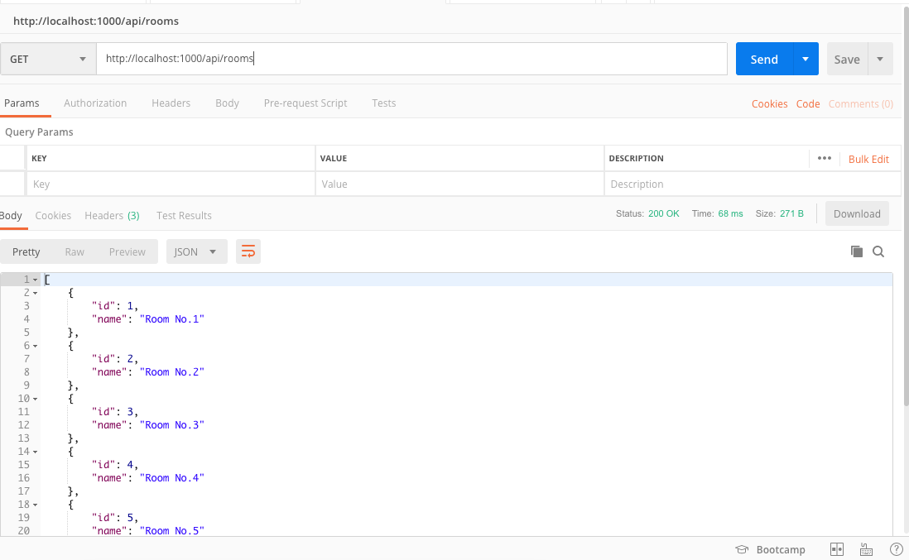
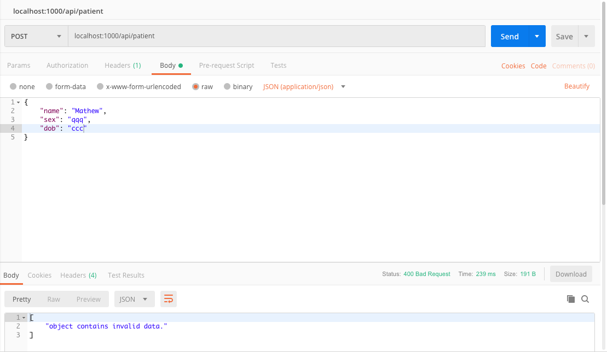
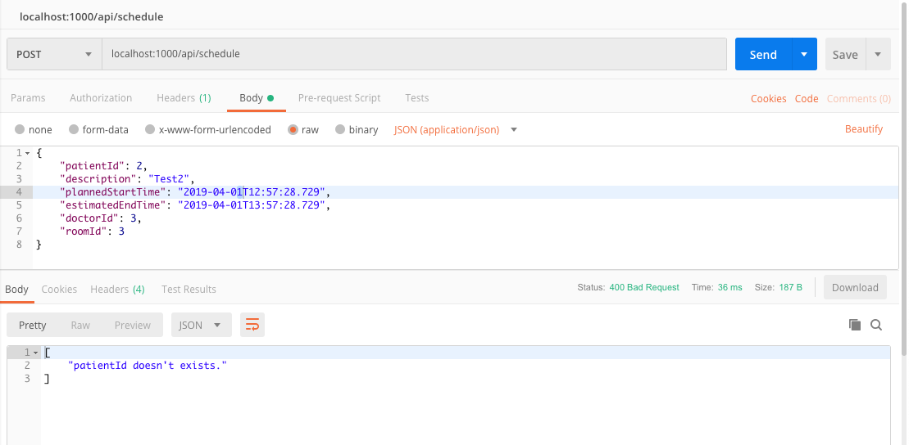
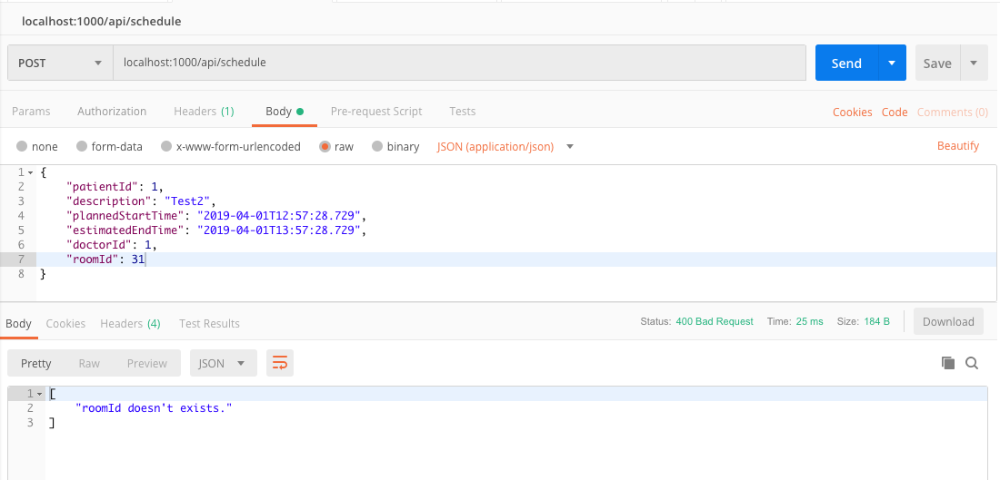
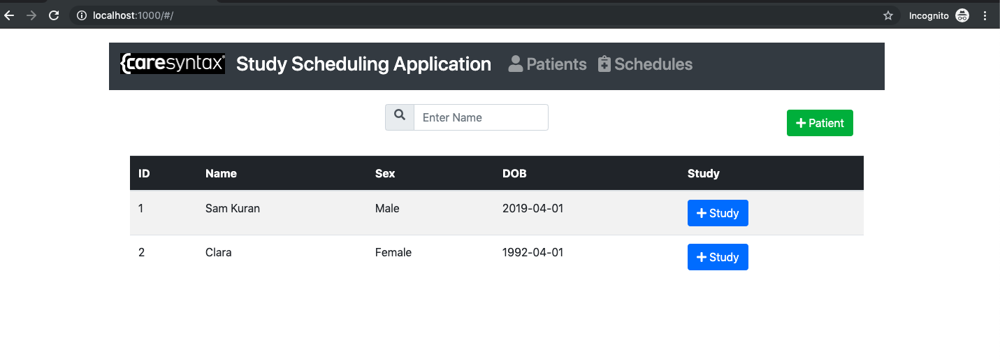
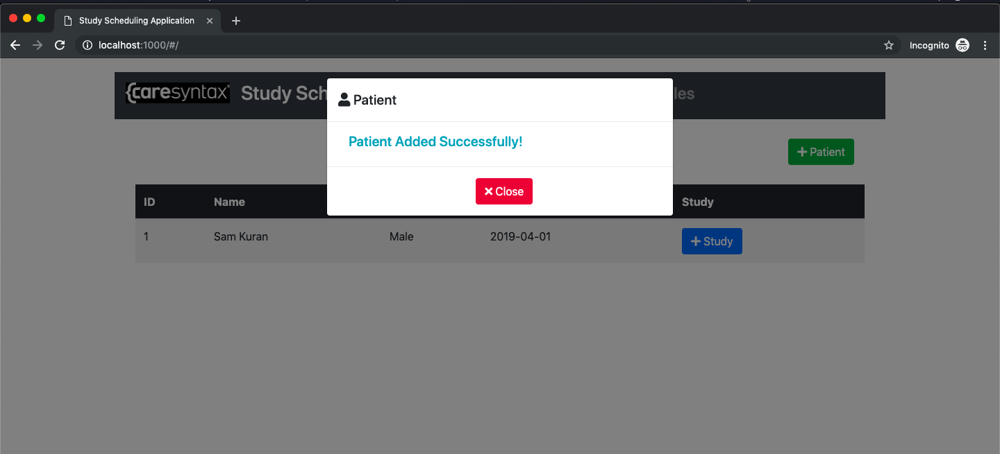
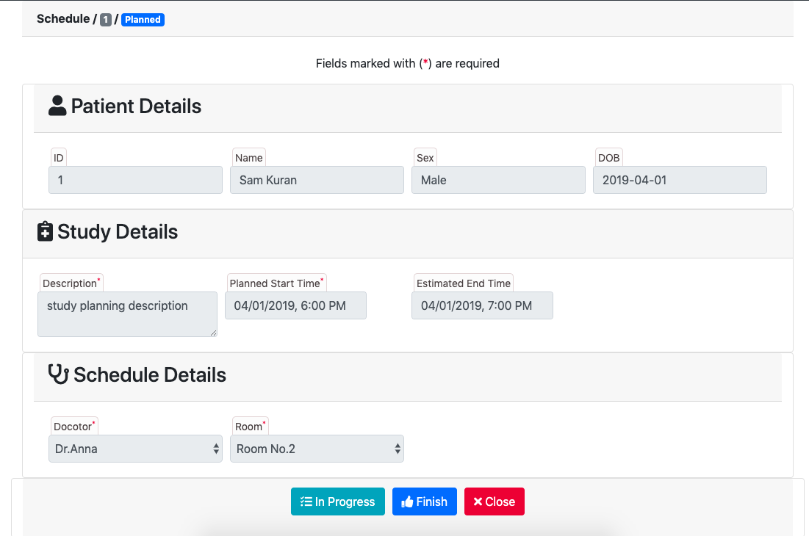
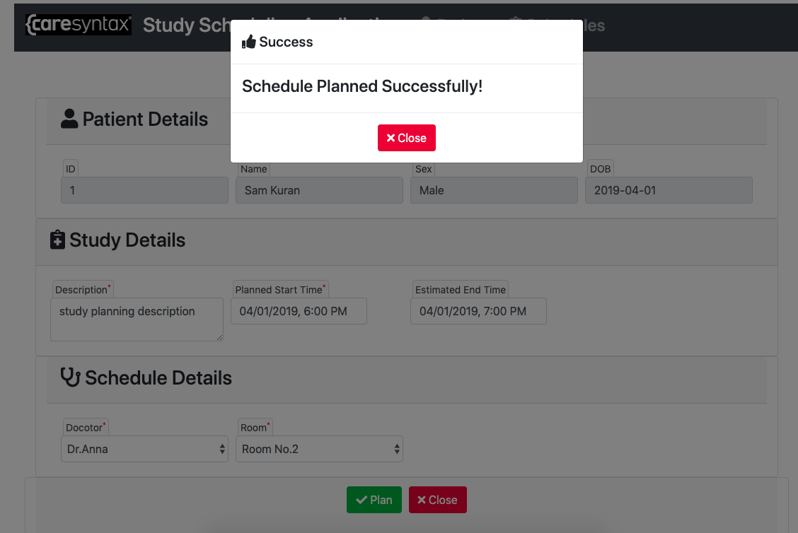

# procedure-scheduling-app
Implement a study scheduling application in which procedures for treatment of patients performed by doctors are planned.

    
    

    
    

    
    

    
    

